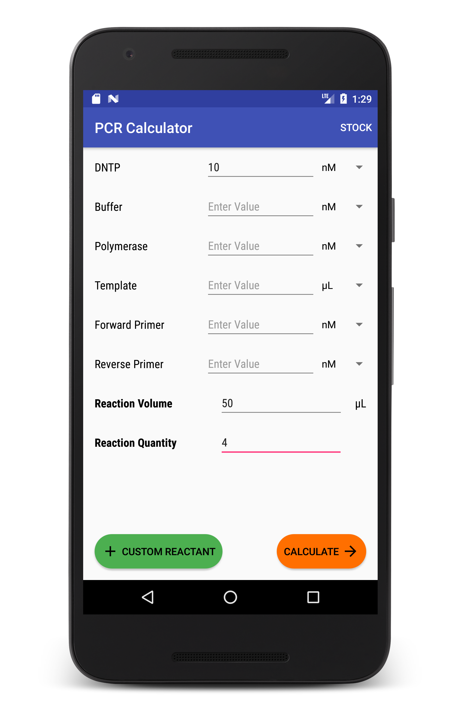

# PCR Assistant for Android 

An Android application to facilitate PCR calculations in the lab.  Enter custom reactants, stock concentrations, and all values in any unit.  Also features a TM Calculator. 



Coming soon to the Google Play Store 

## Installing and Running 
This Android app compiles at API 25, but compatible with API 21 and later. 

Not compatible with Android 4.x

### Android SDK 
You'll need to set your global `$ANDROID_HOME` variable or add a `local.properties` file to the `PcrApp` folder of this repo. That should look something like: 

For macOS:
```
sdk.dir=/Users/yourname/Library/Android/sdk/
```

For Windows:
```
sdk.dir=C:\\Users\\username\\AppData\\Local\\Android\\Sdk
```

### Building the App 
Plug your Android phone into your computer or start an [Android Emulator](https://developer.android.com/studio/run/emulator.html).  Then, run the following in the `PcrApp` folder:
```
$ ./gradlew installDebug
```

## Using PCR App 
A couple things to keep in mind when using this app: 
* Make sure all stock concentrations are entered in the stock concentration screen 
* If you change a reactant's unit and you don't have a compatible stock concentration, it will be dropped! 
